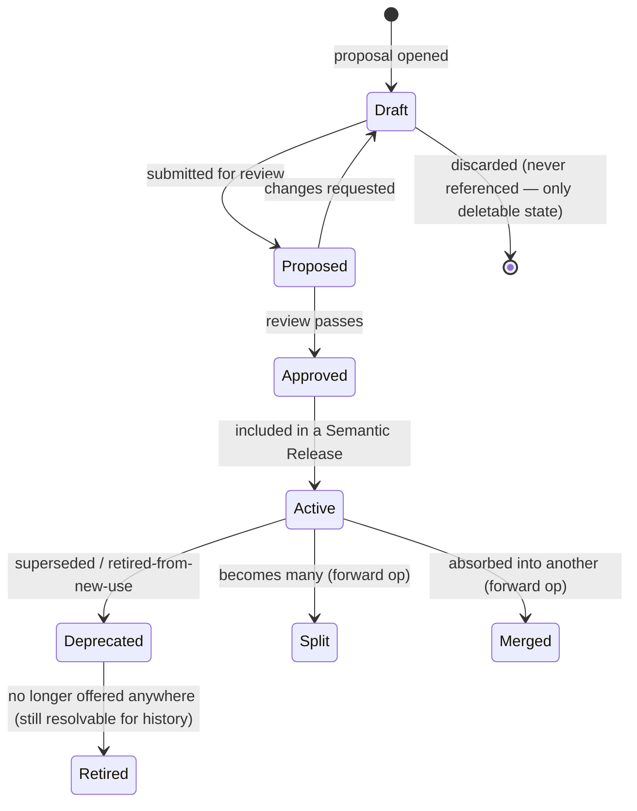
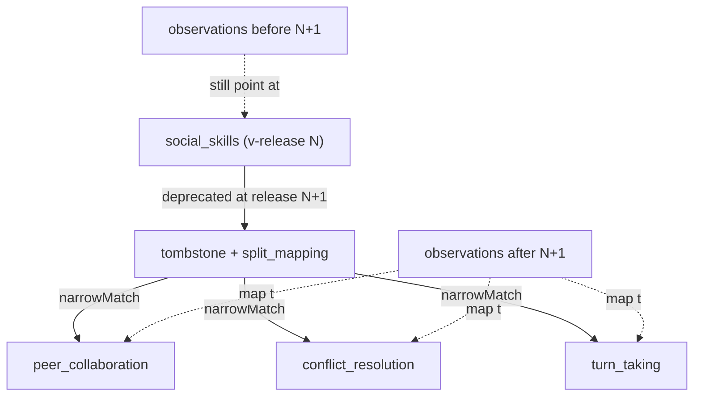
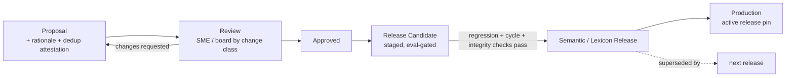

# Elocin — Concept Lifecycle & Semantic Governance

**Status:** design only. Companion to `docs/design/knowledge_graph.md` (which defines the three
graphs — Semantic / Observation / Efficacy — the referential spine, and the ASSERTED/OBSERVED/
INFERRED edge model). This document defines how a **concept is born, changes, splits, merges,
deprecates, localizes, and stays reproducible** across millions of observations, thousands of
concepts, many languages, and many years. It assumes the knowledge_graph.md decisions exist and does
**not** redesign them — except where §11 (Architecture Review) finds a flaw, in which case it says so
plainly.

Scope note: this governs the **Semantic Graph** (and the Lexicon that points into it). The
Observation and Efficacy graphs consume this governance; they do not author it.

---

## 1. Executive summary

An ontology does not fail loudly. It degrades — a duplicate here, a re-parented ID there, a locale
that drifts, a report that no longer reproduces — until the "single source of meaning" is neither
single nor a source of meaning. This document is the set of rules that make that degradation
**structurally hard** rather than merely discouraged.

The governance rests on six load-bearing rules:

1. **Meaning is release-pinned and never rewritten.** A concept means what it meant in the release an
   observation was parsed under. History is additive; corrections are new releases, not edits.
2. **Identity is opaque; taxonomy is edges; labels are localized data.** The stable ID encodes
   *nothing* about position, domain, or language — those are mutable edges and labels.
3. **A concept version never changes meaning. If meaning changes, identity changes.** So IDs can
   *never* change meaning — because any meaning-altering change is modeled as a new identity +
   supersession, not a version bump. (This is the definitive answer to "can IDs change?": no, by
   construction.)
4. **The Governance Ladder:** prefer a new *alias* over a new *concept*; a new *concept* over a
   *redefinition*; a redefinition (new version) over a *mutation* (never). Pressure flows to the
   cheap, reversible, language-layer end.
5. **Language versions independently from meaning.** The Lexicon (fast, frequent, low-risk) and the
   Semantic Graph (slow, rare, high-risk) have **separate release trains**. An observation pins both.
6. **Governance rigor scales with blast-radius × team size.** A new alias is nearly automatic; a
   split/merge is a board decision with a migration plan. A solo founder runs the light path; a
   50-person org runs the heavy one; the *rules* are the same, the *ceremony* differs.

The three most important corrections this review makes to the existing design are in §11:
**(A)** make canonical IDs opaque (drop human-readable/hierarchical IDs as identifiers);
**(B)** split the single `edges` table by graph so a GDPR erasure of a child's OBSERVED edges can
never touch — and is not even *able* to touch — the curated Semantic Graph;
**(C)** version the Lexicon independently from the Semantic Graph.

---

## 2. Design principles

- **Additive-only history.** Nothing released is ever mutated or deleted. Rollback = roll *forward* +
  re-pin (§7, §9).
- **Creation is expensive; aliasing is cheap.** New *meaning* is a gated editorial act; new *words
  for existing meaning* are near-frictionless. This asymmetry is the primary defense against concept
  explosion.
- **The parser never creates concepts.** It maps to existing concepts or misses (→ `lexicon_misses`).
  A miss is fuel for a human proposal, never an auto-creation.
- **Normative claims are framework-scoped, never spine-level.** "Expected by age 5" is an attribute of
  `(concept × framework × locale)`, never of the concept. The internal spine holds *observable
  competencies*, not one culture's developmental norms.
- **Uniqueness of meaning is a governance guarantee, not a DB constraint.** No key can encode
  "means the same thing." Creation is gated by a duplication check + a reviewer attestation, backed
  by a periodic de-duplication audit.
- **Every concept has a review SLA.** Ontologies rot from staleness (outdated mappings, retracted
  citations), not only from bad additions. Concepts carry `last_reviewed` + a cadence; stale ones are
  flagged.

---

## 3. Concept lifecycle

### 3.1 States



- **Only `Draft` is deletable**, and only if never referenced by any observation, edge, or release.
  Everything from `Active` onward is permanent (observations reference it forever).
- `Deprecated` and `Retired` remain **resolvable** — a 2026 observation pointing at a retired concept
  still renders, under its pinned release.

### 3.2 Creation — who, what's mandatory, uniqueness

**Who may create** (role-gated; ceremony scales with team — §4.4):

| Change class | Minimum authority |
|---|---|
| New **alias / lexicalization** (existing concept) | contributor + automated checks (the lexicon proposer path) |
| New **concept** (skill/indicator/goal/intervention/strategy/assessment) | subject-matter reviewer (educator) |
| **Split / merge / deprecate / re-parent** | governance board + migration plan |

**Mandatory on any new concept:** stable ID (minted, opaque — §3.3); type; canonical definition (the
*intension* — what it means, independent of examples); at least one `en` label; concept scheme /
domain placement (as an edge, not baked into the ID); **rationale** ("why this concept, why now");
**duplication attestation** ("checked against existing concepts + aliases; not a duplicate of X, Y");
proposer identity. **Optional:** misconceptions, prerequisites/related (edges), progression pointer,
parent/teacher explanations, framework mappings, citations, age expectations (framework-scoped),
localized labels — all addable later as minor versions.

**Uniqueness enforcement (layered):**
1. *Automated:* label-per-locale-per-scheme collision warning; alias-collision check against the
   Lexicon; embedding-similarity flag to nearby concepts (advisory, at proposal time).
2. *Editorial:* the reviewer must explicitly attest non-duplication.
3. *Audit:* a scheduled de-duplication review clusters near-synonymous concepts for merge review.
   Duplication is inevitable at scale; the defense is *detection + merge*, not prevention alone.

### 3.3 Stable IDs (the strategy)

**Canonical ID = opaque + flat + immutable.** Recommended: a URI over an opaque slug or ULID
(`elocin:concept/01J9Z6…` or a minted stable slug `elocin:concept/one_to_one`). Properties:

- **Opaque / flat:** encodes no domain, no parent, no language, no version. Taxonomy position is
  expressed by **edges** (`isChildOf`), not by the identifier string.
- **Immutable:** never reassigned, never re-pointed. A concept's ID outlives its labels, its parents,
  and its framework mappings.
- **Meaning-frozen:** the ID is bound to a *meaning*, not a *string*. See §3.4 for why this makes
  "can an ID change meaning?" a definitional *no*.

**Human-readable notation** (`NUM.COUNT.ONE_TO_ONE`) is a **label**, not an identifier — a mutable,
localizable `skos:notation`. (This corrects the v1 knowledge_graph.md ambivalence — see §11-A. A
hierarchical readable ID becomes a lie the first time you re-parent or split; taxonomy must live in
edges.)

**Deprecated concepts** keep their ID, flip `status`, gain a `supersededBy` edge (if replaced) and a
tombstone (reason, release, date). They are never offered to the parser or the authoring UI for
*new* use; they remain fully resolvable for historical rendering.

### 3.4 Versioning of a single concept

**A concept version never changes what the concept *means*.** Permitted version changes are
meaning-preserving only:

- **Minor:** additive, non-meaning-changing — a new framework mapping, a new indicator, a new alias
  pointer, a refined (not redefined) explanation, a new localized label.
- **Patch:** cosmetic — typo, wording, citation correction.

There is deliberately **no "major version" of a concept**, because a change that would alter meaning
(narrow it, widen it, re-scope it) is **not a version — it is a new identity** (split / merge /
supersede — §3.5). This is the entire reason IDs can be promised stable: the system has *no
operation* that mutates a released concept's meaning in place. Correcting a genuinely wrong concept =
deprecate it + create the right one + record the supersession; historical observations keep pointing
at the (still-correctly-meaning) old concept as of their release.

### 3.5 Splits and merges (the hardest operation)

When `Social Skills` → `Peer Collaboration` / `Conflict Resolution` / `Turn Taking`, the honest,
non-negotiable fact is: **you cannot deterministically re-classify the old observations** — their
raw text would need re-reading to know which child was collaborating vs. taking turns. So the design
refuses to pretend:

- **History is not rewritten.** Existing OBSERVED edges keep pointing at `social_skills`, which still
  *means what it meant* in their pinned release. The split is a **forward** operation: new
  observations (post-split-release) map to the finer concepts.
- **A `split_mapping` record** captures the one-to-many relationship, marked **`disambiguation:
  requires_reobservation`** — i.e. analytics may *not* silently distribute old `social_skills`
  evidence across the three children.
- **Analytics chooses its lens explicitly:** either (a) roll the three children *up* to the old
  `social_skills` via `broadMatch` for a longitudinal series that spans the split, or (b) restrict
  fine-grained queries to post-split observations. Never (c) fabricate a distribution.
- **Merges are the tractable direction:** `Turn Taking` + `Sharing` → `Cooperative Play` records a
  many-to-one `merge_mapping`; old edges roll up cleanly (the union is well-defined). Even so, the
  old concepts are **deprecated, not deleted**, and old observations keep their original pointers.
- **Mappings may be one-to-many and partial.** A split can send 80% of a concept's meaning to child A
  and 20% to child B; the mapping records weights *for analytics rollup only* — it never
  retroactively re-labels an individual child's observation.



### 3.6 Aliases & synonyms

Aliases (`"sounding out"` → phonological decoding) are the **language layer**, not the concept:

- **They live in the Lexicon**, not inside the concept, as `Lexicalization` rows (`surface → concept
  URI`, tier, locale, region, morphology). A concept references *its* meaning; the words that evoke
  it are governed separately and change far more often.
- **Rationale:** aliases are high-volume, low-risk, locale-specific, and grow from real teacher
  language via `lexicon_misses` + the offline proposer. Coupling them to the concept would drag the
  slow, gated Semantic Graph at the speed of the fast, cheap Lexicon.
- **They are localized** (§6): `"sounding out"` (en), `"membunyikan"` (ms) both point at the same
  concept URI.
- **Parser mappings evolve** only through the Lexicon release train (§7), always human-approved,
  always tiered (high = auto-apply, medium = suggestion) — never mutating the concept.

The Governance Ladder in action: a teacher's new phrasing becomes a *new alias* (trivial), not a
*new concept* (gated). This is the single most important lever against concept explosion.

---

## 4. Governance model

### 4.1 Workflow



### 4.2 Review gates (automated, run on every Release Candidate)

- **Regression:** the parse-fixture + eval harness must not regress (the existing
  `seed_parses.json` / `lexicon:eval` discipline, extended to the graph).
- **Graph integrity:** `isChildOf` forms a forest (no multi-parent surprises unless intended);
  `prerequisiteOf` is **acyclic** (cycle detection — a prerequisite loop is a logical error, §10);
  every edge's endpoints resolve; every INFERRED edge has its lineage (the CHECK constraints).
- **Referential integrity:** no dangling framework mappings; no alias pointing at a retired concept.
- **Governance completeness:** every new concept has definition + rationale + dedup attestation +
  approver.

### 4.3 Roles & multi-stage approval

Approvals are **multi-stage and role-gated by change class** (not one-size-fits-all):

| Change | Propose | Review | Approve | Extra |
|---|---|---|---|---|
| Alias / spelling | contributor or proposer bot | automated + spot-check | maintainer | eval gate |
| New concept | educator | SME educator | maintainer | dedup attestation |
| Framework mapping | educator | framework-literate reviewer | maintainer | citation |
| Split / merge / deprecate | educator | **board** (SME + framework + eng) | board sign-off | **migration plan** |
| Efficacy (INFERRED) edge | analysis job | analyst + SME | board | causal-design review |

### 4.4 Governance that scales with the team (anti-over-engineering)

The *rules* above are permanent; the *ceremony* is staged so a solo founder isn't blocked on a
committee:

- **Stage-0 (solo / pre-PMF):** "board" = the founder + a checklist + the automated eval gate; a
  git PR is the proposal/review/approval record. No human committee. (Optimizing governance ceremony
  for the MVP is fine even though we don't optimize the *architecture* for it.)
- **Stage-1 (SME on retainer):** an educator reviews concept + mapping changes; splits/merges still
  need an explicit written migration plan.
- **Stage-2+ (org):** the full role matrix, an ontology maintainer, a periodic review board.

### 4.5 Rollback

Because releases are immutable and additive, **rollback = roll forward + re-pin:**
1. Ship a *new* release that reverts the mistaken change (a forward correction), **and/or**
2. Re-pin live consumers (dashboards, the active parser) to the prior release via the "active
   release" flag.
Never mutate a released concept to "undo." A sent artifact (an IEP) is frozen at its release and is
untouched by either action (§9).

---

## 5. Versioning strategy (releases)

Two **independent** release trains (this is Review finding §11-C, promoted to the core strategy):

- **Lexicon Release** — fast, frequent, low blast-radius: new aliases, spellings, morphology,
  regional vocabulary. Mostly minor/patch. Driven by `lexicon_misses` + the proposer. Never changes
  meaning.
- **Semantic Release** — slow, rare, high blast-radius: concepts, edges, progressions, framework
  mappings, splits/merges/deprecations.

Blast-radius semver at the **release** level (the concept level only ever moves minor/patch — §3.4):

| Level | Semantic Release contains | Consumer impact |
|---|---|---|
| **MAJOR** | splits, merges, deprecations, re-parenting, supersessions | live re-projection must be re-reviewed; frozen artifacts unaffected |
| **MINOR** | new concepts, new mappings, new indicators, new goals/interventions (purely additive) | safe |
| **PATCH** | wording, citations, typos | cosmetic |

**Every stored observation pins a triple** (§7): `{ parser_version, lexicon_release, semantic_release
}` (or a single composite "interpretation-environment" hash). This is what makes an observation
**reproducible years later** and a **report reproducible** (§10): re-run the exact parser + lexicon +
semantic snapshot and you get the byte-identical interpretation. The release is the reproducibility
anchor; per-concept semver is a *human signal* ("did this concept's non-meaning content change?").

---

## 6. Provenance model

Provenance is an **append-only audit graph** (W3C PROV-shaped) attached to every concept version and
every ASSERTED/INFERRED edge. Each answers:

- **Who** proposed / reviewed / approved (identities + roles).
- **When** (bitemporal: decided-at and recorded-at).
- **Why** (rationale text + citations / research sources).
- **What evidence** (for INFERRED edges: the `derivation_id` → reasoning trace + the OBSERVED edges
  and research the analysis consumed).
- **Which release** introduced it, and (if applicable) **which** deprecated it.

Approvals are **multi-stage** (§4.3): proposer ≠ reviewer ≠ approver for high-blast changes
(separation of duties). The provenance record is itself immutable; a later disagreement produces a
*new* review that supersedes, never an edit. This provenance is what powers the product-level "why
was this detected / suggested / selected" explanations — the same lineage, surfaced.

---

## 7. Parser governance

Reproducibility requires pinning **three** independent versions, not one (the current design pins
only `lexicon` — Review finding, §11-D):

1. **Parser (algorithm) version** — the deterministic recognizer code. A change to normalization,
   negation windows, or tiering changes outputs even with a fixed lexicon.
2. **Lexicon release** — the surface→concept mappings.
3. **Semantic release** — the meanings the candidates resolve to.

Design:

- **Every observation stores the triple** (or a composite hash). Re-parsing under the same triple is
  guaranteed byte-identical (the engine is pure — no clock, no network, no ML).
- **Lexicon / mapping versioning:** aliases and tiers move only through Lexicon Releases; each carries
  a **correction history** (what was added/changed, why, by whom) and supports **human overrides**
  (a maintainer can pin/suppress a specific surface→concept mapping, recorded with provenance).
- **Parser confidence** is a signal, not a stored truth — the *inputs* (which triggers fired, tiers,
  negation) are stored as provenance so the confidence can be re-derived, not just trusted.
- **Correction loop is one-directional:** teacher corrections and misses flow to `lexicon_misses` →
  proposer → human-approved Lexicon Release. Corrections **never** hot-patch a stored observation;
  they change *future* parsing. An old observation re-rendered under a new release is an explicit
  *re-projection*, never a silent rewrite.

**Invariant:** the parser only ever emits candidates for **existing** concepts. It cannot mint
meaning. This closes the concept-explosion loop: teacher language pressure lands in the Lexicon, not
the Semantic Graph.

---

## 8. Localization strategy

Localization is **two different problems**, and conflating them is a classic failure:

- **Label localization (cheap, common):** a universal concept, many languages. `one_to_one` carries
  `label(en) = "one-to-one correspondence"`, `label(ms)`, `label(zh)`, `label(ja)` — plus localized
  parent/teacher explanations and localized aliases in the Lexicon. Same concept URI everywhere. This
  is the 90% case.
- **Semantic localization (rare, real):** some meanings are **not translation-invariant**. Te
  Whāriki's *mana*, Montessori's specific material sequences, or a jurisdiction-specific competency
  may have **no clean equivalent**. The design must allow a **locale-scoped concept** that exists only
  in some frameworks and maps to the neutral spine via `broadMatch`/`relatedMatch` — *not* forced
  into an `exactMatch` that lies. A concept may be *not universal*, and that must be first-class.

Corollaries:
- **Regional terminology, shared identity** is the label-localization case: US "kindergarten" vs UK
  "reception" vs AU "prep" are locale labels/aliases over shared (or `closeMatch`) concepts.
- **Age-band conventions are locale data** (school-year start differs) — an `age_expectation` is keyed
  by `(concept × framework × locale)`, never global.
- **Translation is versioned like everything else** and human-reviewed; a machine-drafted translation
  is a *proposal* (advisory AI), never auto-published into a child's report.

---

## 9. Migration & backward compatibility

The central tension: **reproducibility** (immutability) vs. **correction** (we improved the
taxonomy). Resolved by making both modes explicit and choosing sane defaults:

- **Frozen replay (default for *sent* artifacts):** a report/IEP/parent letter renders exactly as it
  did, under the release triple it was generated with, **forever**. A taxonomy change in 2028 does not
  alter a report sent in 2026. This is a compliance and trust requirement, not a preference.
- **Live re-projection (default for *live* surfaces):** a dashboard or an in-progress profile renders
  under the *current* release, so teachers see today's best taxonomy. Historical observations are
  re-projected via mappings (with the split/merge honesty rules of §3.5 — no fabricated
  distributions).
- **The artifact stores its release triple** so either mode is always available and the choice is
  explicit, per surface — never a silent global regenerate.

Tradeoffs (stated, per the brief):

| | Frozen | Live re-projection |
|---|---|---|
| Reproducibility | perfect | changes over time |
| Reflects best current knowledge | no (stale) | yes |
| Trust / legal (sent docs) | correct default | dangerous default |
| Longitudinal comparability | within a release only | requires mapping-aware rollups |
| Cost | store the artifact + triple | store observations; recompute on read |

**Migration of a taxonomy change never migrates the *data*.** Splits/merges/deprecations produce
*mappings*; observations keep their original pointers; re-projection happens at read time by choice.
There is no batch job that rewrites historical OBSERVED edges — that would destroy reproducibility
and, worse, invent meaning that was never observed.

---

## 10. Failure modes (and the governance that prevents each)

| Failure | How it happens | Prevention |
|---|---|---|
| **Ontology drift** | concept's real (extensional) meaning wanders as observations accrete | review SLA + periodic drift audit (compare a concept's attached evidence against its definition); meaning-change forces new identity (§3.4) |
| **Duplicate concepts** | idiosyncratic proposals; parallel authoring | creation gated + dedup attestation + similarity flag + scheduled de-dup merge audit |
| **Concept explosion** | every phrasing → a new concept | Governance Ladder: phrasing → *alias*, not concept; parser can't create; creation is expensive by design |
| **Conflicting terminology** | same word, different meaning across locales/frameworks | words live in Lexicon (locale-scoped), meaning in Semantic Graph; a surface form may map to different concepts per locale — explicit, not accidental |
| **Circular relationships** | prerequisite/child cycles | DAG/acyclicity check in the Release gate (§4.2); a cycle blocks the release |
| **Localization inconsistency** | a locale label drifts from the concept's meaning; partial translations | translations versioned + reviewed; missing-label fallbacks explicit; semantic-vs-label localization separated (§8) |
| **Parser drift** | parser/lexicon change silently alters past interpretations | triple-pin (§7) + frozen replay + one-directional correction loop |
| **Broken historical reports** | taxonomy change regenerates old artifacts | frozen replay default for sent artifacts; artifact stores release triple (§9) |
| **Efficacy edge rot** | a validated "what works" claim contradicted by new data | INFERRED edges are recomputed + retireable via a new derivation/review; never hand-patched (§ knowledge_graph.md §6/§8) |
| **Anti-moat accumulation** | scale amplifies biased/wrong evidence into confident claims | validation gate + causal-design review on INFERRED edges; accumulation ≠ validation |
| **Governance ossification** | heavyweight process blocks a solo team | ceremony scales with team (§4.4); rules constant, ritual staged |

---

## 11. Architecture review — findings against the existing design

Acting as a review board over `knowledge_graph.md`. Three corrections, two additions, one
"over-engineered," delivered without deference to the prior author (me).

**A. (Correction — accept) Canonical IDs must be opaque and flat; drop human-readable/hierarchical
IDs as identifiers.** `knowledge_graph.md` offered both a URI *and* a hierarchical notation
(`NUM.COUNT.ONE_TO_ONE`) and was ambivalent about which is canonical. Verdict: a hierarchical ID
encodes taxonomy into the identifier, and taxonomy *moves* (re-parenting, splits). The moment it
moves, the "stable" ID either lies or must change — both fatal. **Canonical ID = opaque; the readable
string is a mutable `notation` label.** (Folded into §3.3.)

**B. (Correction — accept) Split the single `edges` table by graph.** `knowledge_graph.md` unified
ASSERTED/OBSERVED/INFERRED into one `edges` table with CHECK constraints. Elegant, but it co-locates
**curated, permanent, no-PII** semantic edges with **per-child, deletable, PII** observation edges.
Two problems: (1) a **GDPR/erasure** request must delete a child's OBSERVED edges *without being able
to touch* the Semantic Graph — one table makes that a dangerous surgical delete instead of a
partition drop; (2) they have opposite retention rules (never-delete vs. must-delete). **Recommend
physically separate `semantic_edge` / `observation_edge` / `efficacy_edge`**, logically unified by a
view. The edge-kind *taxonomy* stays; the single *table* goes. (Also improves partitioning — §16 of
knowledge_graph.md.)

**C. (Correction — accept) Version the Lexicon independently from the Semantic Graph.** A single
monolithic Knowledge Release means every alias/typo fix cuts a whole-graph release and re-runs the
full eval — editorial velocity dies at thousands of concepts. **Two release trains** (§5): Lexicon
(fast) and Semantic (slow). This is just the "language separate from meaning" principle applied to
*versioning*, and it's a strict improvement. (Promoted to §5.)

**D. (Addition — required) Triple-pin the parser, not just the lexicon.** Reproducibility needs
`{parser_version, lexicon_release, semantic_release}`. The current design pins only `lexicon`, so a
change to normalization/negation code silently un-reproduces old parses. (Folded into §5, §7.)

**E. (Addition — required) A concept review SLA / anti-staleness cadence.** Nothing in the current
design obligates *re-review* of existing concepts. Ontologies rot from stale mappings and retracted
citations as much as from bad additions. Add `last_reviewed` + a cadence + a stale-flag report.
(§2, §10.)

**F. (Over-engineered — trim for now) Multi-stage approval boards and per-concept semver are Stage-2
apparatus.** For a solo pre-PMF team they're theater. Keep the *rules* (separation of duties for
high-blast changes) but run them as a checklist + git PR + eval gate until an SME/board actually
exists (§4.4). Don't build board tooling before there's a board.

**Not changed (challenged, upheld):** the three-graph split, the ASSERTED/OBSERVED/INFERRED
epistemology, the deterministic record path, framework-neutral spine, and "meaning before
intelligence" all survive scrutiny and are load-bearing here.

---

## 12. Database considerations (entities & relationships only — no DDL)

Tables the lifecycle requires (beyond the knowledge_graph.md set). "→" = references.

| Table | Purpose | Key relationships |
|---|---|---|
| `concept` | stable identity + current status | id (opaque), type, status(active/deprecated/retired), current_version, scheme |
| `concept_version` | append-only content revisions (meaning-preserving) | → concept; semver(minor/patch); introduced_in_release |
| `concept_status_history` | audit of state transitions | → concept; from/to status; release; reason; actor |
| `label` | localized names/notations | → concept_version; locale; kind(pref/alt/notation) |
| `lexicalization` | surface form → concept (the Lexicon) | → concept; locale; region; tier; morphology; introduced_in_lexicon_release |
| `semantic_edge` | ASSERTED edges (taxonomy, prereq, mappings) | → concept×concept; assoc_type; introduced_in_release; **no PII** |
| `observation_edge` | OBSERVED edges (per-child) | → student, concept, observation; confidence; **PII; partitioned; deletable** |
| `efficacy_edge` | INFERRED edges (what works) | → concept×concept; confidence; derivation_id; validation_status |
| `framework` / `framework_item` | external frameworks (CASE-shaped) | scheme; version |
| `framework_mapping` | concept ↔ framework item | match_strength(exact/close/broad/narrow/related) |
| `locale` | jurisdiction + language + conventions | code; language(s); school-year start; governance profile |
| `age_expectation` | normative, framework-scoped | → (concept × framework × locale); band |
| `semantic_release` / `lexicon_release` | immutable snapshots + semver + content hash | the reproducibility anchors |
| `proposal` / `review` / `approval` | governance workflow | → change target; actor; role; stage; decision; rationale |
| `provenance` | who/when/why/evidence (append-only) | → concept_version | edge; PROV-shaped |
| `split_mapping` / `merge_mapping` | forward-only concept restructuring | → old×new(1:N / N:1); weights; `disambiguation` flag |
| `deprecation_record` | tombstone | → concept; supersededBy; reason; release |
| `review_schedule` | anti-staleness | → concept; last_reviewed; cadence; next_due |

---

## 13. Open questions

1. **Release granularity of the Semantic Graph** — monolithic (simplest, most reproducible) vs.
   per-domain (independent evolution, but an observation touching two domains pins two releases).
   Leaning monolithic + content hash; revisit at ~10³ concepts.
2. **Efficacy-edge dispute path** — who can *retire* a human-validated INFERRED edge that new data
   contradicts, and on what evidence bar? (A validated wrong claim is worse than an unvalidated one.)
3. **Cross-framework normative conflict surfacing** — when EYLF and Common Core disagree on age
   expectation, do we show both, the customer's, or none? (Current rule: framework-scoped, show the
   customer's; but do we *warn* when they diverge?)
4. **Lexicon override authority** — can a *single school* pin a local surface→concept mapping (their
   dialect) without forking the global Lexicon? (Tenant-scoped lexicalization overlay?)
5. **De-duplication automation** — how aggressive should the similarity flag be before it becomes
   noise that reviewers ignore?
6. **Bitemporality depth** — do we need full valid-time on the *Semantic* graph (concepts as they
   were believed at a past date), or is release-pinning sufficient? (Likely release-pinning is
   enough; full bitemporal semantic history may be over-engineering.)

---

## 14. Recommendations

1. **Adopt the three review-board corrections now (they're cheap and structural):** opaque flat IDs
   (§11-A), physically separated edge tables by graph (§11-B), and independent Lexicon vs Semantic
   release trains (§11-C). All three are far cheaper before there's data than after.
2. **Pin the parser triple** `{parser_version, lexicon_release, semantic_release}` on every
   observation from day one (§11-D). Retrofitting reproducibility is near-impossible.
3. **Encode the Governance Ladder as the authoring UX**, not just a doc: make adding an alias one
   click and creating a concept a gated form with a mandatory dedup step. The asymmetry *is* the
   anti-explosion mechanism.
4. **Ship governance ceremony staged (§4.4):** Stage-0 = git PR + checklist + eval gate; do not build
   board tooling before a board exists.
5. **Default sent artifacts to frozen replay, live surfaces to re-projection (§9)** — and store the
   release triple on every artifact so the choice is always available and always explicit.
6. **Add the review SLA now (§11-E)** — a `review_schedule` row per concept is trivial to add early
   and impossible to backfill meaningfully later.
7. **Keep the deterministic, human-approved invariants intact:** parser mints no meaning; AI proposes
   aliases/rules/translations but never publishes into a child's record; INFERRED edges are earned,
   validated, and retireable, never typed.

**North star:** the semantic layer stays coherent not because it's frozen, but because *change is
channeled* — into the Lexicon where it's cheap, into new identities where meaning shifts, into
mappings where taxonomy restructures, and never into a silent mutation of what a child was once
observed to do.
```
