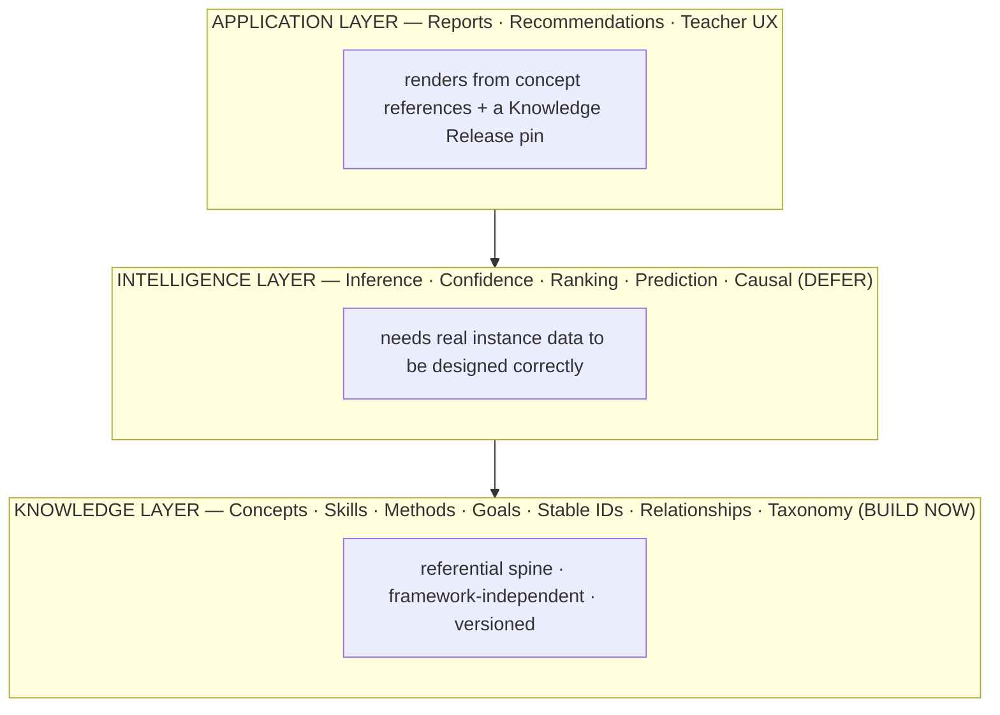
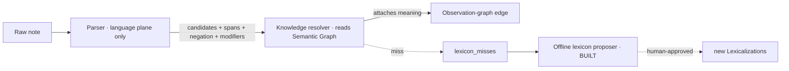
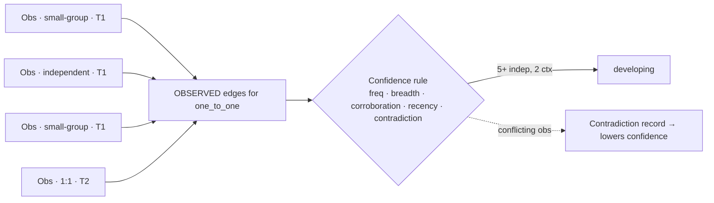
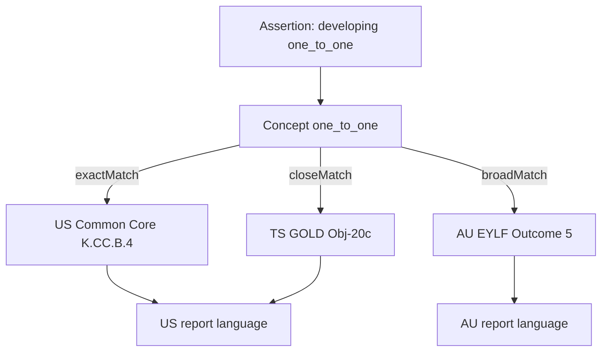

# Elocin Educational Knowledge Graph — Design (v2)

**Status:** design only. Nothing here is built. Blueprint for the "educational intelligence layer"
on a 10-year horizon, optimized for a build order that never bankrupts a pre-PMF team.

**v2 changes (this revision):** restructured around the core principle **Meaning Before
Intelligence**; split the architecture into an explicit three-layer stack (Application / Intelligence
[deferred] / Knowledge [build now]); renamed and hardened the three graphs (**Semantic /
Observation / Efficacy**); promoted **edge epistemology** (asserted / observed / inferred) to a
load-bearing, DB-enforced section; added an explicit **teacher-evaluation ethics boundary** enforced
by architecture, not just policy; reframed the **moat** to the observation→concept mapping layer
(near-term) + the validated Efficacy graph (long-term). v1's 20-deliverable content survives as
§13–§20 / appendices.

**Assumptions (explicit, not blocking):** first market pre-K–grade-2; multi-country is a real future
requirement; team is tiny/pre-revenue/local-only today; the deterministic no-LLM record path (S23)
is a hard invariant; FERPA/GDPR/COPPA/APP-grade governance of children's data is mandatory.

---

## 1. Purpose

Become the central source of truth for every educational concept in Elocin, so the parser, reports,
goals, interventions, analytics, recommendations, and future AI all consume **one** shared model of
meaning instead of re-encoding educational knowledge as scattered strings. The parser identifies
*candidate concepts*; the graph supplies *meaning*.

---

## 2. Core principle — Meaning Before Intelligence

> Build the layer that says **what things mean** before the layer that says **what to do about them.**

The failure mode is not "we didn't build AI." It's "knowledge entered the system as unstructured
text and got duplicated across seven places." The fix is to make every artifact attach to a shared
**concept identity** from day one.

```
Bad — three disconnected strings:
  Observation "Johnny can count objects to 10"   Skill "Counting"   Report "developing numeracy"

Good — one meaning, many attachments:
  Observation ──FK──▶ Concept  NUM.COUNT.ONE_TO_ONE
                          ├─▶ Skill definition
                          ├─▶ Progression indicator
                          ├─▶ Report language (per locale)
                          ├─▶ Intervention library
                          └─▶ Efficacy / research evidence
```

This is why Google invested in *entities* over better keyword matching: the entity layer compounds.
Elocin's equivalent bet is the **referential spine** (§5) — the one thing worth building now.

---

## 3. The layered architecture

Three layers. The boundary between them is the whole design.



**The trap:** building the Intelligence layer before the Knowledge layer is mature. You cannot
credibly answer *"what intervention works?"* until you can answer:

- What *exactly* is the skill? (Knowledge layer)
- What counts as improvement? (a defined progression, not a vibe)
- What interventions were *actually delivered*, and how consistently? (Observation layer, with fidelity)
- What confounds the comparison? (governance + causal design)

Without those, an intelligence layer is "a very sophisticated correlation machine" — confidently
wrong at scale, which for children's records is worse than silent.

**The dividing test for any component:** *does it need real instance data to be designed
correctly?* No → it's Knowledge-layer, build now. Yes → it's Intelligence-layer, defer.

---

## 4. The three graphs

One logical model, three sub-graphs with **different change velocities, storage profiles, and
governance** — which is exactly why they are distinct (and, at Elocin's scale, why they start as
schemas in **one Postgres**, joined at the seams by stable concept URIs — see §4.4).

### 4.1 Semantic Graph — "what exists?"

```
Phonological Awareness ──includes──▶ Phoneme Segmentation ──assessed by──▶ "identifies beginning sounds"
```

Curated · slow-changing · version-controlled · **no child data.** (v1's "Knowledge graph.")

### 4.2 Observation Graph — "what happened?"

```
Student A ──observed──▶ Beginning-Sound Recognition ──during──▶ Small-Group ──by──▶ Teacher B
```

High-volume · messy · probabilistic · **privacy-sensitive.** (v1's "Evidence graph.") Note: an
individual observation here is "evidence *for a skill*" (lowercase) — do not confuse with the capital-E
Efficacy Graph below.

### 4.3 Efficacy Graph ("Evidence Graph") — "what do we know works?"

```
Intervention X ──supports──▶ Skill Y   (evidence strength 0.82)
```

**This edge must never exist because someone typed it.** It exists only when earned:

```
Research → hypothesis   Observation → evidence   Analysis → confidence   Human review → validated relationship
```

Medium-size · slow-growing · curated-but-derived. (v1's "Research graph," now explicitly the
efficacy/what-works layer.) **Terminology guard:** because "evidence" is overloaded in ed-assessment,
in code and UI prefer **Efficacy Graph** for this layer and reserve "evidence" for observations.

### 4.4 How they connect (and why one Postgres)

| Graph | Velocity | Volume | Store (staged) | Governance |
|---|---|---|---|---|
| Semantic | ~static | small (10³–10⁴) | git → Postgres, versioned releases | low-risk, no PII |
| Observation | daily | huge (10⁸–10⁹/decade) | Postgres partitioned → warehouse | **high-risk, children's PII** |
| Efficacy | slow | medium, derived | Postgres + citations; recomputed | derived; validation-gated |

The valuable *and* dangerous queries are the **cross-graph joins** (validate an Efficacy edge against
the Observation graph; render an Observation assertion in Semantic-graph language). They join on
stable concept URIs — which is the entire reason the referential spine (§5) comes first. Logically
three graphs; **physically one Postgres to start** — don't let "three graphs" become three premature
subsystems (the platform-over-engineering trap).

---

## 5. Referential spine — the one thing to build now

The cheap, compounding, reversible core. Everything else defers.

- **Concept IDs / URIs.** Every concept gets a stable, opaque, meaning-frozen ID
  (`elocin:concept/skill/one_to_one`, human-facing notation `NUM.COUNT.ONE_TO_ONE`). If meaning
  changes you mint a *new* concept and `supersedes` the old — you never silently re-point a URI.
  Reports, goals, interventions, parser rules, analytics all **reference** the URI; none embed the
  educational string.
- **Versioning.** (a) stable identity; (b) append-only content revisions per concept, each citing
  its sources; (c) named **Knowledge Releases** (graph-wide immutable snapshots — the lexicon-version
  idea, scaled up) that every stored parse/assertion pins, so a 2026 report re-renders identically
  forever; (d) bitemporal on instance data (valid-time vs transaction-time), which M0's
  raw/current/interpretation split already prefigures.
- **Localization = language split from meaning.** Labels are data, not identity: `prefLabel`/
  `altLabel` per locale live in a **Lexicalization** layer (`surface form → concept URI`, tier,
  language, region, morphology). Renaming a label never touches meaning or invalidates an assertion.
- **Parser as candidate recognizer.** The parser reads only the Lexicalization layer and emits
  `{ span, surfaceForm, candidateConceptURIs[], tier, negated, modifiers[] }` — no domains, no
  taxonomy, no outcome logic. A **knowledge resolver** reads the Semantic Graph to attach meaning.
  This is the concrete refactor of today's `core.v1.json` (which wrongly mixes surface forms and
  taxonomy). The offline lexicon proposer (`scripts/lexicon_proposer.mjs`, already built) grows
  exactly this Lexicalization layer — it is the first, correct instrument of the spine.



---

## 6. Edge epistemology (load-bearing, DB-enforced)

Most knowledge systems fail because they treat all relationships as equal. Elocin's edges come in
**three epistemically distinct kinds**, and the database enforces the distinction so an invalid edge
is *impossible to write*, not merely discouraged.

| Kind | Means | Source | Confidence | Example |
|---|---|---|---|---|
| **ASSERTED** | human-defined truth (a taxonomy decision) | curriculum designer | N/A | `one_to_one isChildOf numeracy` |
| **OBSERVED** | a recorded occurrence | teacher observation | per-instance (noisy) | `Student_123 demonstrated letter_recognition (0.73)` |
| **INFERRED** | a derived relationship | statistical analysis + human validation | required, with lineage | `Intervention_A improves phonological_awareness (0.87)` |

**The edges table (enforcement, not just a column):**

```sql
CREATE TYPE edge_kind AS ENUM ('ASSERTED','OBSERVED','INFERRED');

CREATE TABLE edges (
  id                UUID PRIMARY KEY DEFAULT gen_random_uuid(),
  source_uri        TEXT NOT NULL,
  target_uri        TEXT NOT NULL,
  edge_type         edge_kind NOT NULL,
  confidence_score  REAL,              -- NULL for ASSERTED
  created_by        TEXT NOT NULL,     -- curator | observation source | analysis job+version
  observation_id    UUID REFERENCES observations(id),  -- OBSERVED only
  derivation_id     UUID REFERENCES reasoning_traces(id), -- INFERRED only: how it was earned
  validation_status TEXT,              -- INFERRED: proposed | human_validated | retired
  knowledge_release TEXT NOT NULL,
  created_at        TIMESTAMPTZ NOT NULL DEFAULT NOW(),

  -- an ASSERTED edge is a decision, never a probability
  CONSTRAINT asserted_no_confidence CHECK (edge_type <> 'ASSERTED' OR confidence_score IS NULL),
  -- an OBSERVED edge must point at the observation that evidenced it, with a confidence
  CONSTRAINT observed_needs_obs CHECK (edge_type <> 'OBSERVED'
        OR (observation_id IS NOT NULL AND confidence_score IS NOT NULL)),
  -- an INFERRED edge WITHOUT its derivation + confidence is literally impossible to insert
  CONSTRAINT inferred_needs_lineage CHECK (edge_type <> 'INFERRED'
        OR (derivation_id IS NOT NULL AND confidence_score IS NOT NULL AND validation_status IS NOT NULL))
);
```

Refinements beyond the boolean "evidence_required":

- **INFERRED edges are derived artifacts, not hand-edited.** They are *recomputed* from the analysis
  that produced them (`derivation_id` → a reasoning trace), and carry a `validation_status` so a
  proposed edge is visibly distinct from a human-validated one. You never `UPDATE` an inferred edge's
  meaning; you re-derive and supersede.
- **ASSERTED edges** carry no confidence by construction (a taxonomy decision isn't a probability).
- This table *is* the "why chain": every recommendation is a walk over edges whose kind tells you the
  epistemic weight of each step.

---

## 7. Intelligence layer (deferred)

Recommendations · ranking · prediction · causal modeling. Deferred until the Observation graph
supplies real data — because its shape is *dictated* by that data. When built:

- **Recommendations = versioned declarative rules executed by a deterministic engine that emits a
  full ReasoningTrace** (clinical-decision-support pattern). Eligibility is deterministic and
  explainable; AI may *rank* advisory, never determine eligibility.
- **Prediction / causal** is the last and most dangerous piece (§9). A co-occurrence in the graph is
  not a causal claim; the INFERRED edge kind exists precisely to stop the system from asserting one.

---

## 8. Evidence governance

How OBSERVED edges accumulate into trustworthy assertions, and INFERRED edges get earned.

- **Confidence accumulation** (versioned Confidence Rules, deterministic + explainable, not a black
  box): frequency (≥N independent), breadth (≥M contexts), corroboration (≥K teachers), duration
  (≥W weeks), **recency decay** (explicit half-life), **contradiction** (surfaced as a first-class
  record, lowers confidence, *never silently dropped*). This generalizes today's crude 0–4 confidence
  into a per-skill, progression-aware model.
- **Validation** for INFERRED edges: a proposed efficacy edge is a *hypothesis* until it survives
  analysis (with an honest causal design — matching / stepped-wedge, not raw co-occurrence) **and**
  human review. Only then does `validation_status` flip to `human_validated`.
- **Human review** is the gate on every knowledge change (git PR for Semantic edits; validation
  workflow for Efficacy edges). AI proposes; humans dispose.

---

## 9. Privacy & ethics boundaries

Multi-country is a **legal** problem before a language one. Two boundaries are architectural, not
advisory.

**(a) Children — no profiling by default.** GDPR (profiling of children), FERPA, COPPA, Australian
APPs. Predictive/profiling models on children are gated behind explicit consent + a DPIA; analytics
run on **de-identified cohorts**; data residency is per-locale. **"Risk indicator" is reframed** to
*"area to observe more closely"* — never screening, never diagnosis (clinical-adjacent liability).

**(b) The teacher-evaluation landmine — enforced by architecture, not policy.** The system collects
when teachers observe, what they identify, how often they intervene, and student outcomes. An
administrator will *naturally* ask "which teachers are better at spotting delays?" — but observation
rate ≠ teaching quality (population differences and documentation style confound it), and answering
it turns a support tool into a surveillance tool.

- **Policy:** the system optimizes teacher *support*, not teacher *ranking*.
  - Allowed: *"Teachers who receive literacy observation prompts identify more literacy indicators"* (improves support).
  - Not allowed: *"Teacher X is worse — fewer indicators"* (ranking).
- **Mechanism (the part policy alone can't guarantee):** teacher identity lives in the Observation
  graph (needed operationally) but is **stripped or k-anonymized in the Efficacy/analytics
  projection.** "Rank teacher X against outcomes" isn't a query someone must remember not to run — it
  is a join the analytics schema **cannot express**, because teacher identity and outcome are never
  co-present in that projection. Governance you can forget to enforce is governance that fails.

---

## 10. The moat (reframed)

The **schema is not the moat** — competency schemas exist (1EdTech **CASE**, **CEDS**, **Ed-Fi**;
Teaching Strategies **GOLD** is a proprietary de-facto standard). Anyone can draw the graph. Two
things compound and *are* defensible, at different horizons:

- **Near-term moat — the observation→concept mapping layer (the "nervous system").** A teacher writes
  *"he heard the first sound in cat but needed help with dog,"* not *"demonstrates phonological
  awareness through phoneme manipulation."* Converting `messy observation → semantic concept →
  developmental trajectory → actionable intervention` is the hard problem, and every trial note plus
  every validated mapping improves it. This compounds **from day one of trials** and is exactly what
  the lexicon flywheel + proposer + resolver build. **This is the central asset — the graph is the
  skeleton; the parser + validated mappings are the nervous system.**
- **Long-term moat — the validated Efficacy graph.** INFERRED edges earned with causal credibility at
  scale ("this intervention actually improves this skill for this profile") are the hardest thing to
  replicate — but only compound *with methodological rigor*. Accumulating biased/noisy efficacy edges
  is an **anti-moat**: confidently-wrong recommendations at scale. The moat is *validated* accumulation,
  not accumulation.

Both are downstream of the referential spine: duplicated knowledge doesn't compound, it rots.

---

## 11. Migration path

Additive, reversible, eval-gated (VERIFY→REBUILD→LOCK→EXTEND; the `seed_parses.json` fixture is the
locked interface through the refactor). Maps to the deferred-vs-now boundary.

- **Stage 0 — Semantic graph only (now).** Split language from meaning: extract Lexicalization out of
  `core.v1.json`; make the parser emit candidates only; mint stable concept URIs for the existing ~26
  skills, 16 teaching strategies, outcome valences, domains; make reports/goals/interventions
  *reference* URIs. Introduce `concept`/`concept_version`/`knowledge_release` seeded from a
  `knowledge/` git tree (mirrors `gen_seed.mjs`). Keep parse output byte-identical. Run the lexicon
  proposer on real misses.
- **Stage 1 — Observation accumulation.** Add `context`, the `edges` table (ASSERTED seeded from the
  taxonomy; OBSERVED written by the resolver), 2–3 Learning Progressions (counting, phonics,
  self-regulation) with levels + indicators + age bands. No intelligence yet.
- **Stage 2 — Evidence modeling.** Assertions (bitemporal) + versioned confidence rules; migrate the
  0–4 confidence in additively. Contradiction records. First framework mapping (one market).
- **Stage 3 — Recommendation engine.** Deterministic rules + reasoning traces; reusable goal/
  intervention templates; templated parent/teacher narratives; the Efficacy graph's *proposed*
  INFERRED edges (validation-gated). Then — only when scale/queries justify — projections
  (Postgres+AGE / vector / warehouse) and multi-country governance.

---

## 12. Database & storage recommendations (summary)

Graph *model* now; graph *database* later; **Postgres as the single source of truth.** The knowledge
is tiny (RAM-sized); the volume is instances (partitioning, not graph, problem). Curated knowledge
authored in **git** (reviewable, diffable, reproducible, regression-tested), seeded into Postgres.
Projections added on demand: **Postgres + Apache AGE** (openCypher in-DB) or Neptune/Neo4j for
traversal at scale; **pgvector** for RAG; a **columnar warehouse** on de-identified cohorts for
analytics. Standards compliance (**SKOS RDF + CASE JSON**) is generated as an *export*, not paid for
as a triplestore. One authoritative store, many projections; projections are caches rebuilt per
Knowledge Release.

---

## 13. Sample records

One coherent slice (YAML for authoring; stored as rows + JSONB). Semantic → Observation → Efficacy.

```yaml
# knowledge/concepts/skill.one_to_one.yaml  — Semantic Graph, a Concept version
uri: elocin:concept/skill/one_to_one
notation: NUM.COUNT.ONE_TO_ONE
type: Skill
version: 3
domain: elocin:concept/domain/numeracy
labels:
  en-US: { pref: "one-to-one correspondence", alt: ["one to one counting", "touch counting"] }
definition: "Assigning exactly one number word to each object when counting a set."
prerequisites: [ elocin:concept/skill/rote_counting ]     # ASSERTED edges
related:       [ elocin:concept/skill/cardinality ]        # ASSERTED edges
misconceptions: [ { id: skip_or_double_count, text: "Skips or double-counts when not tracking touched items." } ]
progression: elocin:progression/one_to_one
explanations:
  parent:  "Your child is learning to point to each item as they say each number."
  teacher: "Watch for stable order + one-tag-per-object; separate rote sequence from correspondence."
citations: [ doi:10.xxxx/clements-sarama, framework:AU-EYLF-Outcome5 ]
framework_mappings:                                        # ASSERTED cross-framework edges
  - { item: framework:US-CommonCore/K.CC.B.4, match: exactMatch }
  - { item: framework:TS-GOLD/Obj20c,         match: closeMatch }
  - { item: framework:AU-EYLF/Outcome5,       match: broadMatch }
```

```yaml
# knowledge/lexicon/en-US.yaml  — Lexicalization ONLY (no education logic)
- { text: "counted the bears one by one", -> : elocin:concept/skill/one_to_one, tier: high }
- { text: "touch counted",                -> : elocin:concept/skill/one_to_one, tier: high }
- { negation: ["skipped some", "lost track", "double counted"] }   # cue only; rules decide meaning
```

```json
// OBSERVED edge (Observation Graph) — per-student, PII, confidence per instance
{ "id":"e_...", "edge_type":"OBSERVED", "source_uri":"student:stu_123",
  "target_uri":"elocin:concept/skill/one_to_one", "confidence_score":0.73,
  "observation_id":"obs_...", "created_by":"teacher:usr_...",
  "knowledge_release":"kr_2027.03" }
```

```json
// INFERRED edge (Efficacy Graph) — earned, never typed; impossible to insert without lineage
{ "id":"e_...", "edge_type":"INFERRED", "source_uri":"elocin:intervention/count_and_move",
  "target_uri":"elocin:concept/skill/one_to_one", "confidence_score":0.82,
  "derivation_id":"rt_...", "validation_status":"human_validated",
  "created_by":"analysis:efficacy_v4", "knowledge_release":"kr_2027.03" }
```

```json
// Assertion + reasoning trace — the "why chain", walkable over edges
{ "assertion_id":"as_...", "student_id":"stu_123", "concept":"elocin:concept/skill/one_to_one",
  "level":3, "scale_value":"developing", "confidence":0.74, "valid_from":"2027-03-01",
  "knowledge_release":"kr_2027.03", "derived_from":["e_a1","e_a2","e_a3","e_a4","e_a5"],
  "reasoning_trace":{ "rule":"confidence/developing",
    "evidence":"5 OBSERVED edges, 2 contexts, 1 teacher, 3 weeks", "contradictions":[],
    "assumptions":["age band AU-5to6","release kr_2027.03"],
    "alternatives":["secure — not met: needs 2nd teacher + 3rd context"] } }
```

---

## 14. Additional diagrams

**Evidence accumulation (OBSERVED → assertion):**



**One assertion, many frameworks (multi-country projection):**



---

## 15. Advantages over relational-only

Model advantages (implementable *in* relational if you adopt concept+typed-edge tables): framework
independence via N:M mappings, zero duplication via URI reference, extensibility via edge types +
JSONB, language decoupled from meaning, versioned/provenanced knowledge. Genuine graph-*engine*
advantages (later, for the Efficacy/analytics projection): variable-length path queries
("transitive prerequisites of S", "shortest learning path to goal G"). Honest counterpoint: at
today's scale a well-designed relational schema of this *model* gets ~80% of the value; the engine
earns its keep only later — hence "graph model, relational store, graph projection later."

---

## 16. Scalability analysis

Knowledge/Semantic: 10³–10⁴, RAM-sized, editorial not compute bottleneck. Lexicalization: 10⁴–10⁶
across locales, trie/index. Observation: 10⁸–10⁹/decade — partition by org/time, roll up to
assertions, archive raw (OLTP/time-series, not graph). Efficacy: derived, recomputed per release.
Analytics/RAG: warehouse + vector, de-identified, scale independently. **The knowledge never has a
scale problem; the instances do — and that's a partitioning problem, not a graph-DB purchase.**

---

## 17. Tradeoffs

Capability vs build cost (mitigate: stage; build the spine, defer the engine). Editorial bottleneck
is the real long pole (mitigate: authoring copilot *advisory*; start narrow; eval-gated releases).
Standards vs speed (adopt CASE/SKOS at the boundary, pragmatic internally). Determinism vs "magic"
(full explainability is the correct trade for children's records). No canonical framework (more
mapping, but the only multi-country-scalable choice). Graph model in a relational store (forgo native
path queries now to avoid ops burden; accept a projection-sync cost later).

---

## 18. Risks

Over-engineering pre-PMF (highest — build the spine, defer the rest). Content validity & cultural
validity (a wrong/biased progression is worse than none; framework-relative norms, expert review,
citations required, never "universal truth"). Cross-border children's-data law (launch blocker, not a
footnote). **Teacher-evaluation drift (§9b) — mitigated by architecture, not just policy.** Risk-as-
pseudo-diagnosis (reframe to "observe more closely"). Determinism erosion (the §6/§7 boundary +
tests). Framework licensing (map structure freely; legal review before ingesting any content text —
GOLD is proprietary). Projection drift (rebuild from source of truth per release; projections are
caches). **Anti-moat accumulation** — unvalidated efficacy edges make confident wrong claims.

---

## 19. Long-term roadmap

```mermaid
flowchart LR
  S0[Stage 0 — NOW<br/>Semantic graph + referential spine.<br/>Language/meaning split.<br/>Lexicon proposer BUILT.] -->
  S1[Stage 1<br/>Observation accumulation.<br/>edges table · 2–3 progressions.] -->
  S2[Stage 2<br/>Evidence modeling.<br/>Assertions · confidence rules · 1st framework map.] -->
  S3[Stage 3<br/>Recommendation engine + traces.<br/>Proposed Efficacy edges (validation-gated).<br/>Projections · multi-country governance.] -->
  S4[Stage 4 — decade<br/>Longitudinal growth.<br/>Predictive (consent+DPIA gated).<br/>Agentic coaching · curriculum planning · research contributions.]
```

---

## 20. Appendix — brief's entities mapped to this design

- *Sufficient as-is:* Domain, Skill, Subskill, Learning Progression, Developmental Stage, Observation
  Example, Lexicon, Synonym, Misspelling, Verb Pattern, Teaching Strategy, Intervention, Goal, Success
  Criteria, Assessment Method, Evidence Rule, Confidence Rule, Parent/Teacher Explanation, Activity,
  Material, Milestone, Prerequisite, Related Skill, Cross-domain Relationship, Curriculum Framework,
  Framework Mapping, Country Mapping, Age Band, Evidence, Recommendation, Report Narrative, Tag,
  Alias, Version, Citation, Research Source.
- *Reframed:* Outcome → skill-relative valence facet; Observation Pattern → Indicator; Risk/Strength
  Indicator → "area to observe / celebrate" (never diagnosis); Prerequisite/Related/Cross-domain →
  typed **edges** with an epistemic **kind** (§6).
- *Added (＋):* Concept (unifier), Lexicalization/Surface Form, Progression Level, Indicator,
  Misconception (first-class), Rubric/Scale, Context/Setting, EvidenceObservation (OBSERVED edge),
  Assertion, ReasoningTrace, Contradiction, Provenance/Agent, Knowledge Release, Locale/Region, Data
  Governance Scope/Consent, Cohort/Benchmark, Morphology rule, Confidence-modifier/Negation cue,
  **Edge (with `edge_type` ASSERTED/OBSERVED/INFERRED)**.
```
